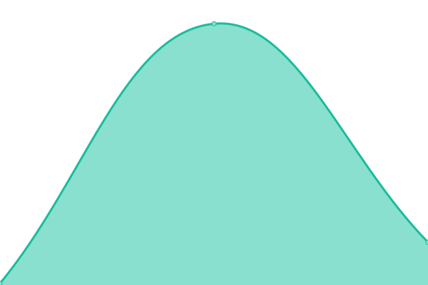

# [📈 Live Status](https://status.mote.page): <!--live status--> **🟧 Partial outage**

<!--start: status pages-->
<!-- This summary is generated by Upptime (https://github.com/upptime/upptime) -->
<!-- Do not edit this manually, your changes will be overwritten -->
<!-- prettier-ignore -->
| URL | Status | History | Response Time | Uptime |
| --- | ------ | ------- | ------------- | ------ |
|  [Mote Website](https://mote.page) | 🟩 Up | [mote-website.yml](https://github.com/Mote-Apps/status/commits/HEAD/history/mote-website.yml) | 

 293ms
     
 | 

<a href="https://status.mote.page/history/mote-website">100.00%</a>
    

|  Mote Cloud API | 🟥 Down | [mote-cloud-api.yml](https://github.com/Mote-Apps/status/commits/HEAD/history/mote-cloud-api.yml) | 

 165ms
     
 | 

<a href="https://status.mote.page/history/mote-cloud-api">0.43%</a>
    

<!--end: status pages-->

## 📄 License

- Powered by: [Upptime](https://github.com/upptime/upptime)
- Code: [MIT](./LICENSE) © [Upptime](https://upptime.js.org)
